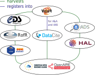

:::::::::::::::::::::::::::::::::::::: questions 

- Journey of your data in the VO

::::::::::::::::::::::::::::::::::::::::::::::::

::::::::::::::::::::::::::::::::::::: objectives

- Understand the integration of astronomy data services in the VO and EOSC.

::::::::::::::::::::::::::::::::::::::::::::::::

## Overview

2 - Journey of your data in the VO
- ‘How your published data gets into EOSC’. 

## Journey of your data

Harvest map from Vizier to EOSC Explore (inferred, not official)

{alt="Diagram showing data harvesting from Vizier to EOSC"}

